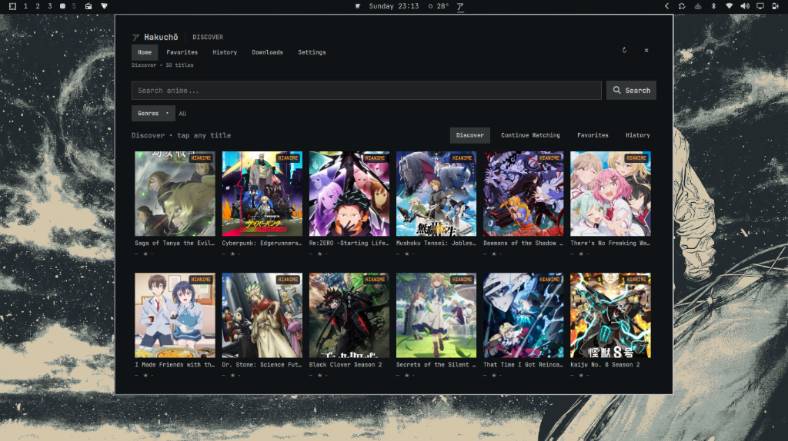
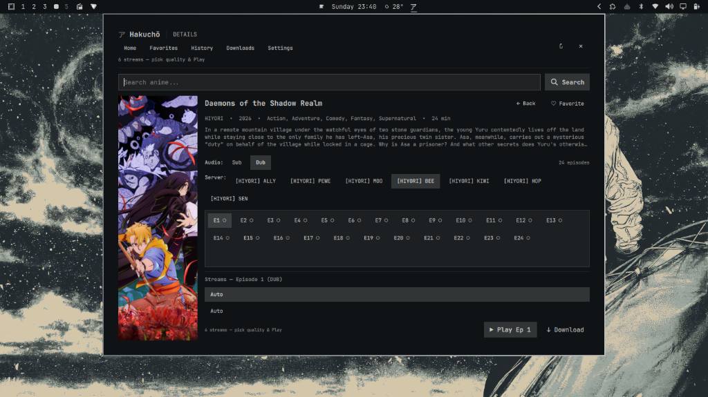
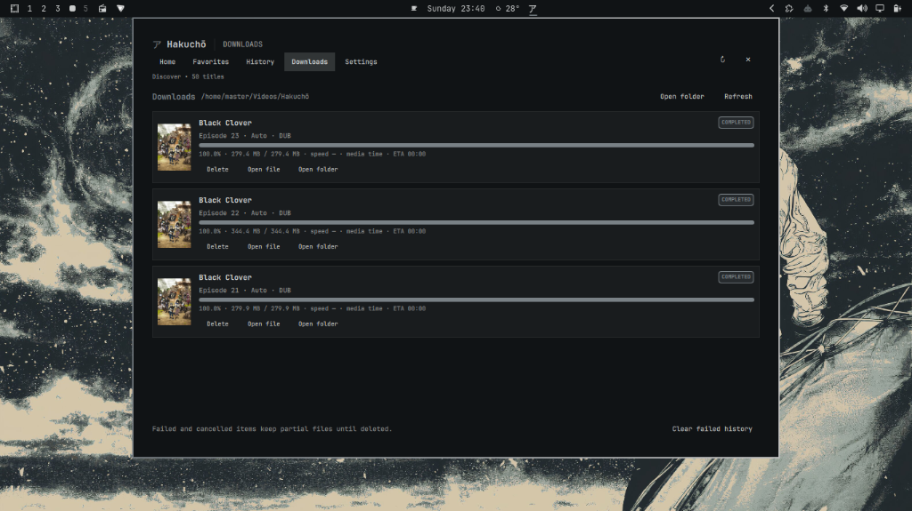
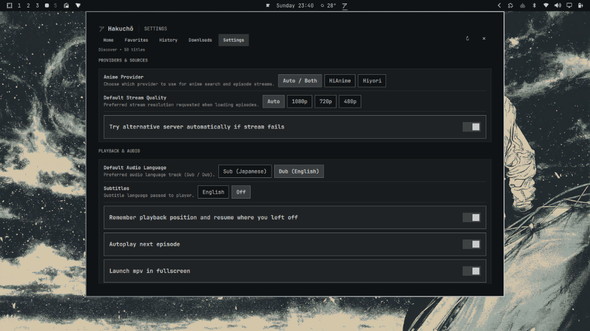

# Hakuchō (白鳥)

**Hakuchō** (formerly *Animechy*) is a fast, modern Quickshell anime streaming and download bar widget for Omarchy Linux. It coordinates multiple streaming providers (HiAnime and Hiyori) with intelligent auto-fallback, SQLite playback/favorite persistence, background health recovery, and hardware-accelerated `mpv` playback.

---

## 📸 Screenshots

| Discover & Trending | Anime Details & Quality Selection |
| :---: | :---: |
|  |  |

| Background Downloads Manager | Settings & Preferences |
| :---: | :---: |
|  |  |

---

## Credits & Acknowledgements

- **Original Creator**: **Yeshey Tenzin** ([@yesheytenzin](https://github.com/yesheytenzin)) – Creator of the original [Animechy](https://github.com/yesheytenzin/animechy.git) plugin for Omarchy.
- **Inspiration**: [pystardust/ani-cli](https://github.com/pystardust/ani-cli) for anime streaming reference and scraper concepts.

---

## 🚀 Quick Install

### Option 1: Git Clone (Manual Setup)

```sh
git clone https://github.com/nice-man-arch/hakucho.git ~/.config/omarchy/plugins/io.github.nice-man-arch.hakucho && omarchy-shell shell rescanPlugins && omarchy plugin enable io.github.nice-man-arch.hakucho
```

### Option 2: Local Checkout Script

```sh
./install.sh
```

> **Why is the installation only one command?**
> 1. **Zero Compilation / No Virtualenv**: Hakuchō's backend uses Python 3's built-in standard library (`urllib`, `sqlite3`, `http.server`, `json`). It requires no `pip install`, wheels, or C build tools.
> 2. **Standard Plugin Discovery**: Omarchy / Quickshell automatically looks for plugins inside `~/.config/omarchy/plugins/<id>`.
> 3. **Self-Managing Lifecycle**: When the top bar widget loads, it automatically starts the local backend server (`backend/server.py`) and manages its lifecycle.
> 4. **Hot-Reloading**: `omarchy-shell shell rescanPlugins` immediately loads the plugin into the running desktop environment without requiring a system reboot or session restart.

---

## Requirements

- **Omarchy** with Quickshell
- **Python 3.12+** (standard library only)
- `curl`, `mpv`, and `ffmpeg` (for playback and downloads)

The backend stores SQLite state in `${XDG_CACHE_HOME:-~/.cache}/hakucho/hakucho.sqlite3`.

Click **ア** in the top bar to open Hakuchō. Plugin startup launches the loopback backend and logs to `${XDG_STATE_HOME:-~/.local/state}/hakucho/backend.log`. Downloads are saved under `~/Videos/Hakuchō` (override with `HAKUCHO_DOWNLOAD_DIR`).

To launch the backend manually while developing:

```sh
python backend/server.py
curl 'http://127.0.0.1:8765/search?q=one%20piece'
```

For provider routing diagnostics, start the backend with `HAKUCHO_DEBUG_SOURCES=1`. Debug logs include the selected episode number and exact provider episode reference, provider/server/language, resolved stream URL and the mpv argv. Stream/source responses are never stored in the metadata cache. This flag prints temporary third-party stream URLs to the backend log, so enable it only while diagnosing playback.

## Architecture

```text
Hakuchō Quickshell/QML
       │ local JSON HTTP
       ▼
backend/server.py ── SQLite cache/history/favorites/provider references
       │ provider registry
       ├── HiAnime adapter ── current HiAnime episode/server API ── ZokoAnime HLS
       └── Hiyori adapter ── Miruro Native API ── kiwi / arc / zoro / jet / …
       │
       └── validated short-lived source token ── mpv
```

The QML only calls the local JSON backend. It does not run ani-cli or parse terminal output. Ani-cli was inspected as a source reference; the existing provider in this application is the independently implemented HiAnime adapter, not the ani-cli CLI process.

`backend/providers/base.py` defines `search(query)`, `details(anime_id)`, `episodes(anime_id)` and `sources(episode_id, language)`. Providers are registered in `backend/server.py`. Provider-qualified IDs (`hianime:…`, `hiyori:…`) keep provider IDs distinct. For HiAnime results, the backend looks for a MAL ID and only attaches Hiyori server records when Hiyori search returns the same MAL ID. It records those exact references in SQLite. It never equates a HiAnime slug with an AniList ID or silently links only by title.

Hiyori uses its documented JSON API directly: `/search`, `/info/{anilist_id}`, `/episodes/{anilist_id}`, and each episode's exact `/watch/{provider}/{anilistId}/{category}/{slug}` ID. Episode records keep the real server and language choices. Each server is separately selectable; sources are fetched only after selection. Returned quality variants and subtitle tracks are passed through to the UI/mpv. Hiyori is an external service and may block requests or change its response format. See the [Hiyori API documentation](https://api.hiyori.tv/).

Search runs both providers concurrently and combines their real results. A provider error is logged and reported if no provider succeeds. When HiAnime's MAL ID maps exactly to a Hiyori result, its server choices are joined to each matching episode; the HiAnime/ZokoAnime path remains available too. If a server fails, the episode stays open and the user can select another server. The UI does not silently change the selected server.

Stream responses are not cached. The backend issues expiring, one-use source tokens; `/play` accepts a token instead of a caller-supplied URL, then invokes mpv with an argument array and no shell. Metadata/episode results use SQLite TTL caching. The mpv IPC socket is placed under the private Hakuchō cache directory and sampled for persistent playback position/duration.

## Local library

- **Continue Watching and Watch History** read SQLite playback records, including exact episode references, provider, position, duration and watched state. History can be cleared without touching favorites.
- **Favorites** are stored locally with the provider-qualified anime ID, canonical ID when known, and cached title/art metadata, so the list remains available when providers are offline.
- The details page shows watched/currently watching markers for episodes and allows users to select the actual provider and language options returned for that episode. Automatic fallback is opt-in and reports each attempt.
- Settings persist through the existing SQLite configuration store. Implemented controls cover automatic server fallback, resume, preferred sub/dub language, download location/quality/concurrency, and download completion/failure notifications.
- History stores anime ID, AniList/MAL canonical IDs when known, provider episode reference, episode number, playback position, duration, watched status and last-played time.

The selected source can be downloaded in the background with `ffmpeg`, which remuxes the provider stream into an MKV file. Downloads run in a bounded worker pool (one to four workers) and report ffmpeg media-time progress when duration is available, along with bytes written, byte rate, and ETA when calculable. Jobs support pause, resume, cancel, retry, and safe deletion of failed/cancelled partials; completed files are found again after a backend restart. They do not share or change mpv playback processes. The live provider still determines playlist availability and required headers; separate subtitle URLs are not packaged into the MKV.

## JSON API

| Endpoint | Purpose |
| --- | --- |
| `GET /health` | provider registry status |
| `GET /search?q=...` | real results from available providers |
| `GET /anime/{provider-qualified-id}` | metadata |
| `GET /anime/{provider-qualified-id}/episodes` | episode and server options |
| `GET /watch/{provider}/{anilistId}/{sub-or-dub}/{slug}` | live Hiyori source lookup |
| `GET /recent`, `/history`, `/favorites` | local library data |
| `POST /ipc` | JSON operation bridge used by the existing QML |
| `POST /play` | consumes a short-lived source token and launches mpv |

The `/ipc` bridge also accepts `download` (consumes a current source token), `downloads`, `download_control`, `download_retry`, `download_delete`, and `status`. Download jobs and settings use the existing Hakuchō SQLite database.

Errors use distinct kinds such as `no_results`, `provider_unavailable`, `network_failure`, `provider_blocked`, `anime_unavailable`, `episode_unavailable`, `no_stream`, `stream_url_invalid` and `mpv_failure`. Provider-qualified anime IDs route to exactly that adapter; source requests include the selected server's provider and exact episode reference. The backend binds to `127.0.0.1` by default.

## Add a provider

Implement the provider interface in `backend/providers/`, return provider-qualified anime IDs, preserve exact episode references in `servers`, and raise `ProviderError` with a useful error kind. Add the provider to the registry. If linking identities, use an exact external ID (AniList/MAL/etc.); uncertain title matches must not become canonical links. Return only source URLs obtained from the live provider response and include the provider's actual quality, language and subtitle metadata.

## Testing

Deterministic tests do not need network access:

```sh
python -m unittest discover -s tests -v
```

To probe Hiyori live manually (network access and service availability required):

```sh
curl -fsS 'https://api.hiyori.tv/search?query=one%20piece' | python -m json.tool
```

## Troubleshooting

- **No search results:** check the query and inspect the backend log. An empty result means providers answered but had no matches.
- **Provider unavailable or blocked:** inspect `~/.local/state/hakucho/backend.log`; test Hiyori and HiAnime independently. Hiyori may rate-limit or reject some networks.
- **Missing Hiyori servers on a HiAnime title:** cross-provider merging requires an exact MAL ID mapping. A title-only guess is intentionally not used.
- **Server/source failure:** leave the episode open and select another server from those actually returned by the provider.
- **Subtitles/audio:** external subtitle tracks are sent to mpv; HLS audio selection is handled by mpv. A provider may hard-sub its stream or provide no external subtitle file.
- **mpv failure:** run `mpv --version` and install it with `sudo pacman -S mpv`.
- **Widget missing:** use `omarchy plugin list`, enable `io.github.nice-man-arch.hakucho`, and rescan plugins with `omarchy-shell shell rescanPlugins`.

## License

This project retains the upstream Animechy GPL-3.0 license. See `LICENSE` for the upstream license text.
